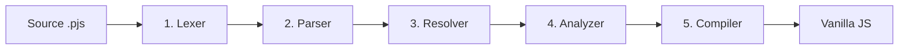

# Pipeline Kompilasi / Compiler Pipeline

> docs/project/ > Compiler Pipeline

Bagaimana file `.pjs` Anda diubah menjadi JavaScript vanilla. PromptJS menggunakan **pipeline 5 tahap** klasik gaya compiler. Dokumen ini di-*ground* ke struktur folder nyata di `src/`.

How your `.pjs` file becomes vanilla JavaScript. PromptJS uses a classic **5-stage compiler pipeline**. This document is grounded in the actual folder structure under `src/`.

---

## Gambaran Umum / Overview

`Source → Lexer → Parser → Resolver → Analyzer → Compiler → JS Vanilla`

Setiap tahap memiliki tanggung jawab tunggal dan menyerahkan hasilnya ke tahap berikutnya. Tidak ada `eval()` atau `new Function()` di mana pun — semuanya statis.

Each stage has a single responsibility and hands its output to the next. There is no `eval()` or `new Function()` anywhere — everything is static.

---

## Tahap demi Tahap / Stage by Stage

### 1. Lexer — `src/lexer/`

**Input:** teks mentah `.pjs`. **Output:** aliran token (tokens).

**Input:** raw `.pjs` text. **Output:** a stream of tokens.

Lexer memecah sumber menjadi token bermakna: keyword (`Buat`, `Jika`), identifier, literal, dan — yang khas PromptJS — token **INDENT/DEDENT** untuk melacak tingkat indentasi (karena struktur ditentukan oleh indentasi, bukan kurung).

The lexer breaks the source into meaningful tokens: keywords (`Buat`, `Jika`), identifiers, literals, and — uniquely to PromptJS — **INDENT/DEDENT** tokens to track indentation levels (since structure is determined by indentation, not braces).

> File / Files: `src/lexer/promptjs-lexer.js`.

### 2. Parser — `src/parser/`

**Input:** token. **Output:** Abstract Syntax Tree (AST).

**Input:** tokens. **Output:** an Abstract Syntax Tree (AST).

Parser menyusun token menjadi pohon sintaks. AST dibangun lewat *factory* (`ast-factory.js`), dan kesalahan sintaks dilaporkan dengan kode error terstruktur (`error-codes.js`) sehingga pesan error konsisten dan dapat dicari.

The parser assembles tokens into a syntax tree. The AST is built via a factory (`ast-factory.js`), and syntax errors are reported with structured error codes (`error-codes.js`) so messages are consistent and searchable.

> File / Files: `src/parser/promptjs-parser.js`, `src/parser/ast-factory.js`, `src/parser/error-codes.js`. Lihat [reference/error-codes.md](../reference/error-codes.md).

### 3. Resolver — `src/resolver/`

**Input:** AST. **Output:** AST yang sudah di-*resolve* (referensi terselesaikan).

**Input:** AST. **Output:** a resolved AST (references resolved).

Resolver menyelesaikan referensi: nama variabel, props komponen, alias tag (`tombol` → `<button>`), dan alias event (`on_klik` → `click`). Ini memastikan setiap simbol menunjuk ke definisi yang benar sebelum analisis.

The resolver resolves references: variable names, component props, tag aliases (`tombol` → `<button>`), and event aliases (`on_klik` → `click`). This ensures every symbol points to the correct definition before analysis.

> File / Files: `src/resolver/promptjs-resolver.js`. Lihat [reference/tag-aliases.md](../reference/tag-aliases.md), [reference/event-aliases.md](../reference/event-aliases.md).

### 4. Analyzer — `src/analyzer/`

**Input:** AST ter-resolve. **Output:** AST + metadata analisis (mis. dependency graph).

**Input:** resolved AST. **Output:** AST + analysis metadata (e.g., a dependency graph).

Analyzer membangun **dependency graph** antar modul/halaman dan melakukan validasi semantik. Informasi ini nantinya memungkinkan *tree-shaking* — hanya kode yang benar-benar dipakai yang masuk ke output.

The analyzer builds a **dependency graph** across modules/pages and performs semantic validation. This information later enables *tree-shaking* — only code that is actually used reaches the output.

> File / Files: `src/analyzer/promptjs-analyzer.js`, `src/analyzer/dependency-graph.js`.

### 5. Compiler — `src/compiler/`

**Input:** AST ter-analisis. **Output:** JavaScript vanilla.

**Input:** analyzed AST. **Output:** vanilla JavaScript.

Compiler menurunkan (*lower*) AST menjadi kode: ekspresi diturunkan (`lower/expression.js`), statement dipancarkan (`emitters/statements.js`), dan runtime helper yang diperlukan ditambahkan (`emitters/runtime.js`) melalui utilitas codegen (`utils/codegen.js`). Di tahap inilah pengamanan codegen (sanitasi `html`, filter atribut) diterapkan.

The compiler *lowers* the AST into code: expressions are lowered (`lower/expression.js`), statements are emitted (`emitters/statements.js`), and required runtime helpers are added (`emitters/runtime.js`) via codegen utilities (`utils/codegen.js`). This is where codegen hardening (`html` sanitization, attribute filtering) is applied.

> File / Files: `src/compiler/promptjs-compiler.js`, `src/compiler/lower/expression.js`, `src/compiler/emitters/statements.js`, `src/compiler/emitters/runtime.js`, `src/compiler/utils/codegen.js`. Lihat [language/security.md](../language/security.md).

---

## Engine & CLI di Sekitarnya / Surrounding Engine & CLI

Pipeline di atas dipanggil oleh lapisan *engine* dan *CLI*:

The pipeline above is invoked by the *engine* and *CLI* layers:

- **Engine** (`src/engine/`) — orkestrasi build (`builder.js`), konfigurasi (`config.js`), CSS (`css.js`), modul (`modules.js`), plugin (`plugins.js`), router runtime (`router-runtime.js`), dan adapter (`adapters/static.js`, `node.js`, `vercel.js`). / Build orchestration, config, CSS, modules, plugins, router runtime, and adapters.
- **CLI** (`src/cli/`) — command `init`, `compile`, `serve`, `build` (`commands/*.js`). / The `init`, `compile`, `serve`, `build` commands.

> Lihat / See: [reference/cli.md](../reference/cli.md), [reference/config.md](../reference/config.md), [language/adapters.md](../language/adapters.md), [language/plugins.md](../language/plugins.md).

---

## Mengapa pipeline ini penting? / Why does this pipeline matter?

1. **Statis & aman** — tidak ada eksekusi dinamis, CSP-friendly. / **Static & safe** — no dynamic execution, CSP-friendly.
2. **Output ramping** — analyzer + tree-shaking memangkas helper yang tidak dipakai. / **Lean output** — analyzer + tree-shaking trims unused helpers.
3. **Error yang jelas** — kode error terstruktur dari parser. / **Clear errors** — structured error codes from the parser.
4. **Dapat diperluas** — plugin dapat menyisip di titik transform tertentu. / **Extensible** — plugins can hook into specific transform points.

---

← [Kembali ke Index / Back to Index](../README.md) · [Testing →](testing.md)
